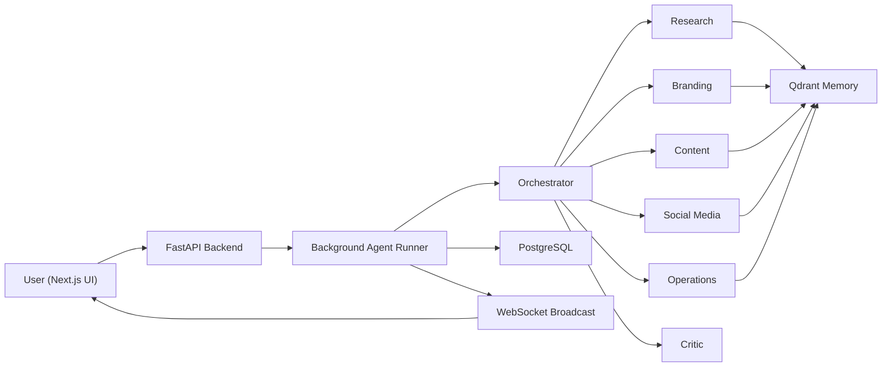
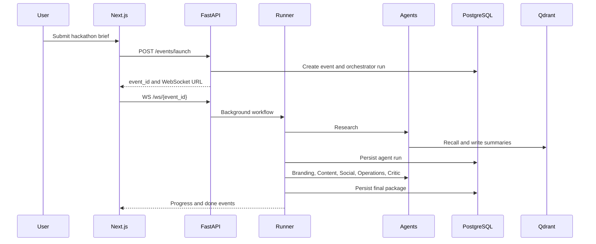

# Architecture

## System Flow

## Workflow Sequence

## Memory Collections

- `event_templates`: past event briefs, final package summaries, operations patterns.
- `sponsor_templates`: sponsor profiles, sectors, pitch angles.
- `marketing_assets`: landing pages, emails, rubrics, brand systems.
- `campaign_history`: social campaign plans and launch patterns.
- `user_preferences`: future per-user style preferences.

Memory writes store concise summaries with metadata. Raw conversation dumps are intentionally not stored.

## Production Notes

- Replace `Base.metadata.create_all` with Alembic before production rollout.
- Turn on `AGENT_RUNTIME=gemini` only after validating API quotas and output quality.
- Use managed secrets for `JWT_SECRET`, `GEMINI_API_KEY`, and `QDRANT_API_KEY`.
- Add auth enforcement to event/project routes once user ownership rules are finalized.
- Promote the deterministic runtime to a test fixture rather than a production fallback.
